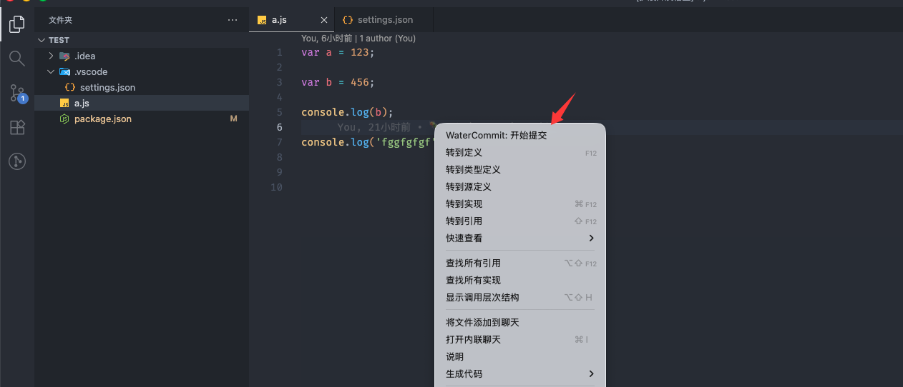
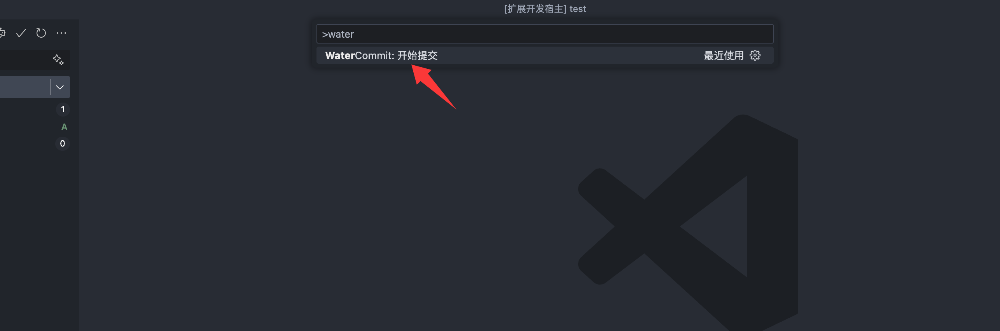
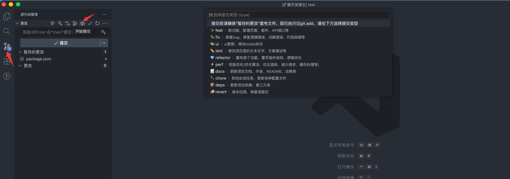
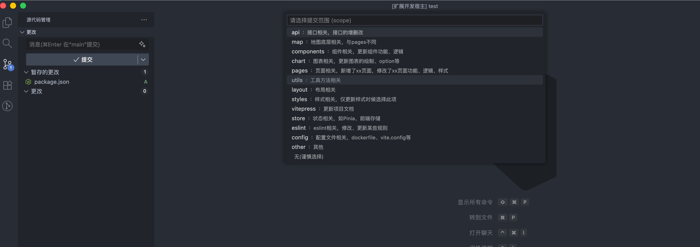
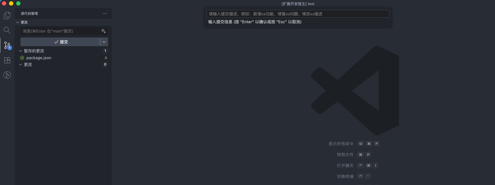
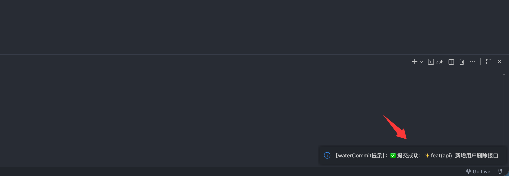
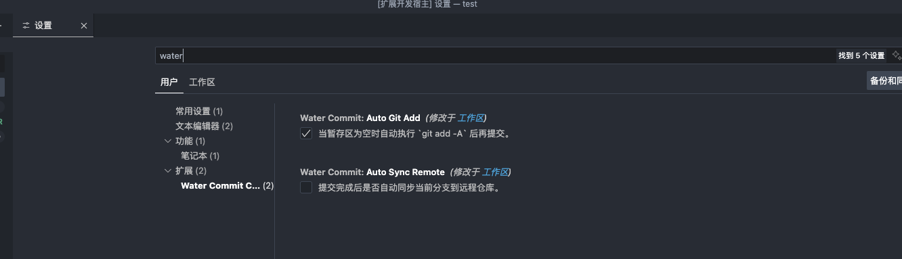

# Water Commit

一款为团队提供 **统一Git提交规范** 的VS Code插件。  
帮助开发者在提交代码时快速生成符合规范的提交信息，让提交历史更清晰、更可读。


## ✨ 功能特性

- 🎉 内置 `type` 和 `scope`，开箱即用，0配置
- 🚀 一键打开提交面板（位于源代码管理视图顶部或编辑区鼠标右键）
- 🧩 支持从 `.commitrc` 文件读取 `type` 和 `scope` 配置
- 💬 支持选择提交类型、作用域并输入提交说明
- 🪄 自动拼接符合约定式提交（Conventional Commit）的信息
- 💎 支持 Emoji 类型标识（例如 ✨ feat、🐛 fix、🎨 ui）
- 📋 暂存区无内容时自动执行 `git add -A`，默认开启，可通过配置 `waterCommit.autoGitAdd=false` 关闭
- 🔄 支持自动推送远程仓库，默认关闭，可通过配置 `waterCommit.autoSyncRemote=true` 启用

## 🧩 环境要求

| 依赖项 | 版本要求 |
|--------|-----------|
| **VS Code** | ≥ **1.100.0** |
| **Git** | 必须已安装并可在命令行中运行 |
| **项目环境** | 任何 Git 仓库均可使用 |

> 💡 插件会在检测到 Git 仓库时启用。若当前文件夹非 Git 项目，将提示「未检测到Git仓库，请先初始化仓库」。

 
## 🚀 使用方法

### 📦 1. 安装插件
在 VS Code 扩展市场中搜索 **`Water Commit`** 并点击安装。  


### 🧠 2. 启动提交
#### 方法一：在编辑区鼠标右键

在编辑区鼠标右键，选择 `WaterCommit: 开始提交` 即可打开插件，如下图：



#### 方法二：通过命令面板

打开命令面板：

- **Windows / Linux**：按下 `Ctrl + Shift + P`  
- **macOS**：按下 `Command + Shift + P`

输入 `WaterCommit: 开始提交` 并回车，即可启动插件，如下图：



#### 方法三：通过源代码管理 (SCM) 按钮

1. 打开左侧边栏的 **源代码管理** 图标（Git 标志）。  
2. 点击标题栏中的对应的按钮。



### 💬 3. 输入提交信息
插件将依次引导你完成：
1. 选择提交类型（Type）  
2. 选择提交范围（Scope，可为空）



3. 输入提交信息（Subject）



4. 回车进行本次提交（Commit）




## 🧩 自定义配置

### 🔧 1. `.commitrc` 自定义提交类型与作用域

你可以在项目根目录添加 `.commitrc` 文件来自定义提交类型与作用域，该文件需要 `json` 格式，以下是插件预设的配置：

```json
{
  "types": [
    { "name": "提交前请确保 暂存的更改 里有文件，即已执行过git add，请在下方选择提交类型" },
    { "name": "feat", "emoji": "✨", "description": "：新功能，新增页面、组件、API接口等" },
    { "name": "fix", "emoji": "🐛", "description": "：修复bug，修复逻辑错误、功能错误、代码报错等" },
    { "name": "ui", "emoji": "🎨", "description": "：ui更新、修改styles样式" },
    { "name": "text", "emoji": "✏️", "description": "：修改项目里的文本文字、文案描述等" },
    { "name": "refactor", "emoji": "💎", "description": "：重构某个功能、重写组件结构、逻辑优化" },
    { "name": "perf", "emoji": "⚡️", "description": "：性能优化(优化算法、优化渲染、减少请求、缓存处理等)" },
    { "name": "docs", "emoji": "📝", "description": "：更新项目文档、手册、README、注释等" },
    { "name": "chore", "emoji": "🔧", "description": "：其他杂项任务，更新各种配置文件" },
    { "name": "deps", "emoji": "📦️", "description": "：更新项目依赖、第三方库" },
    { "name": "revert", "emoji": "🚑️", "description": "：版本回滚、修复误提交" }
  ],
  "scopes": [
    { "name": "api", "description": "接口相关，接口的增删改" },
    { "name": "map", "description": "地图底层相关，与pages不同" },
    { "name": "components", "description": "组件相关，更新组件功能、逻辑" },
    { "name": "chart", "description": "图表相关，更新图表的绘制、option等" },
    { "name": "pages", "description": "页面相关，新增了xx页面，修改了xx页面功能、逻辑、样式" },
    { "name": "utils", "description": "工具方法相关" },
    { "name": "layout", "description": "布局相关" },
    { "name": "styles", "description": "样式相关，仅更新样式时候选择此项" },
    { "name": "vitepress", "description": "更新项目文档" },
    { "name": "store", "description": "状态相关，如Pinia、前端存储" },
    { "name": "eslint", "description": "eslint相关，修改、更新某些规则" },
    { "name": "config", "description": "配置文件相关，dockerfile、vite.config等" },
    { "name": "other", "description": "其他" },
    { "name": "", "description": "无(谨慎选择)" }
  ]
}
```

### ⚙️ 2. VS Code 插件配置项
在 settings.json（用户或工作区设置）中，可自定义 Water Commit 的行为：

```
{
  // 当暂存区为空时自动执行 `git add -A` 后再提交。
  "waterCommit.autoGitAdd": true,

  // 提交完成后是否自动同步当前分支到远程仓库。
  "waterCommit.autoSyncRemote": false
}
```



## 🕒 Changelog

### 0.0.4

**发布日期:** 2025-10-23

**新增功能：**
- 📔 新增编辑区鼠标右键打开插件

### 0.0.3

**发布日期:** 2025-10-22

**新增功能：**
- 📎 修改README.md文档里图片地址

### 0.0.2

**发布日期:** 2025-10-22

**新增功能：**
- 📋 提交前暂存区无内容自动执行 git add -A，无需手动暂存
- 🔄 支持自动推送到远程仓库，需手动启用:`waterCommit.autoSyncRemote=true`
- ⚠️ 推送失败时提供详细错误信息
- ⚙️ 自动暂存和自动推送支持用户配置

### 0.0.1

**发布日期:** 2025-10-21

**初始版本功能：**
- ✅ 支持交互式选择 type / scope / subject  
- ✨ 自动生成标准化 commit message  
- 💬 提交成功 / 失败信息提示  
- 🧩 支持 SCM 菜单触发命令  
- 💎 Emoji 类型前缀支持  

## 🧑‍💻 作者
**[zhongy](https://marketplace.visualstudio.com/publishers/zhongy)**
